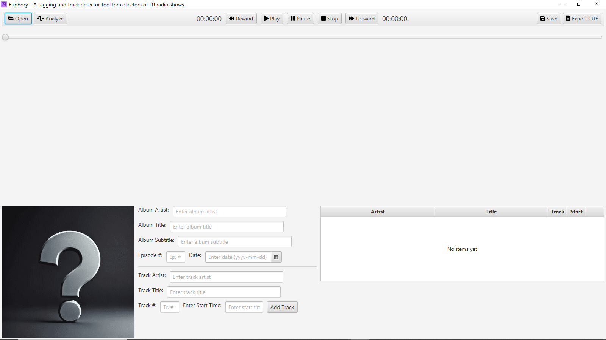

# Euphory

A tagging and track detector tool for collectors of DJ radio shows

## Description

What does this program do?

Right now, pretty much nothing. It is in the planning stage yet.

Planned features include:

- Basic ID3 tagging of audio files with ID3v1.1 and ID3v2.4 support, but not complete, only what is needed for this project
- Hopefully, tracks limits detection using sound analysis, I'm learning the available and suitable algorithms
- ID3 chapters reading and writing, with CUE file support (maybe both importing and exporting?)
- Album cover support, mainly adding and/or changing
- Track detection using sound analysis and some free API (if I can find any)

---

### **Hey DJ, spin that wheel !!!**
